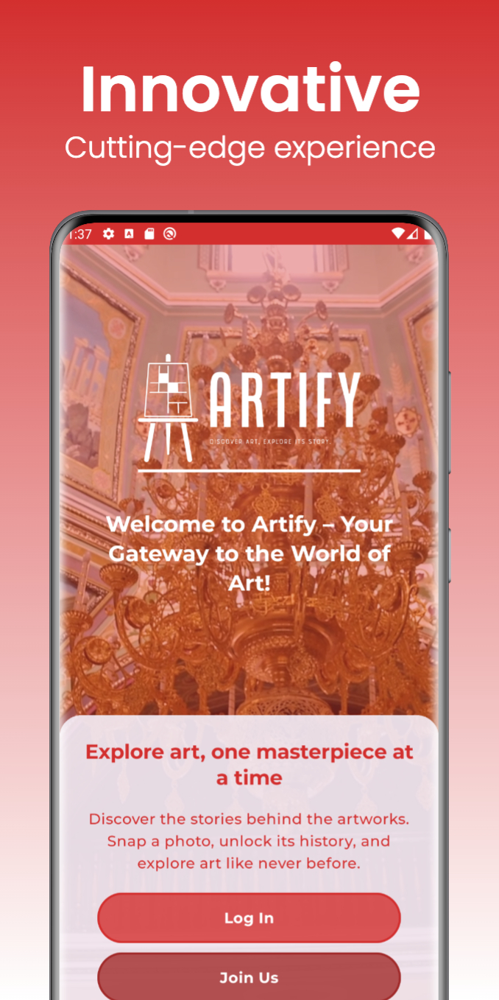
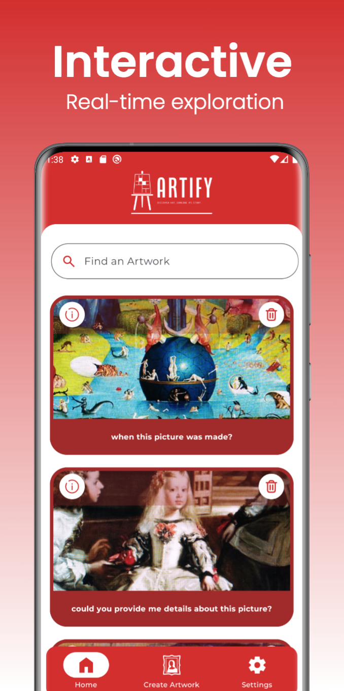
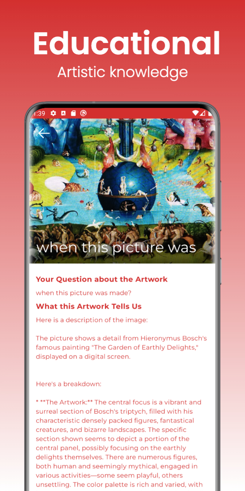
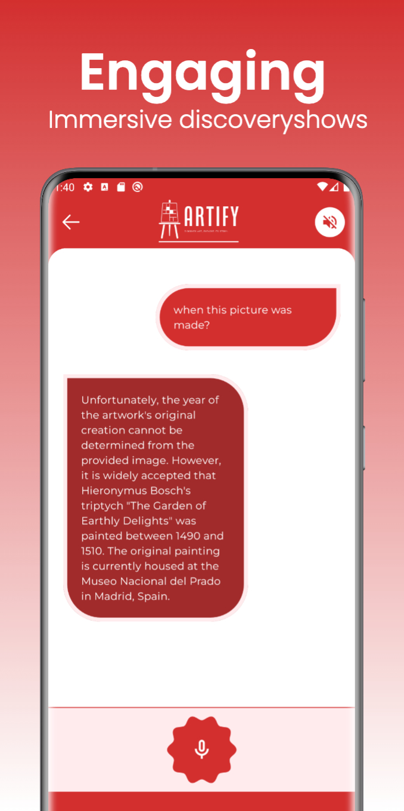
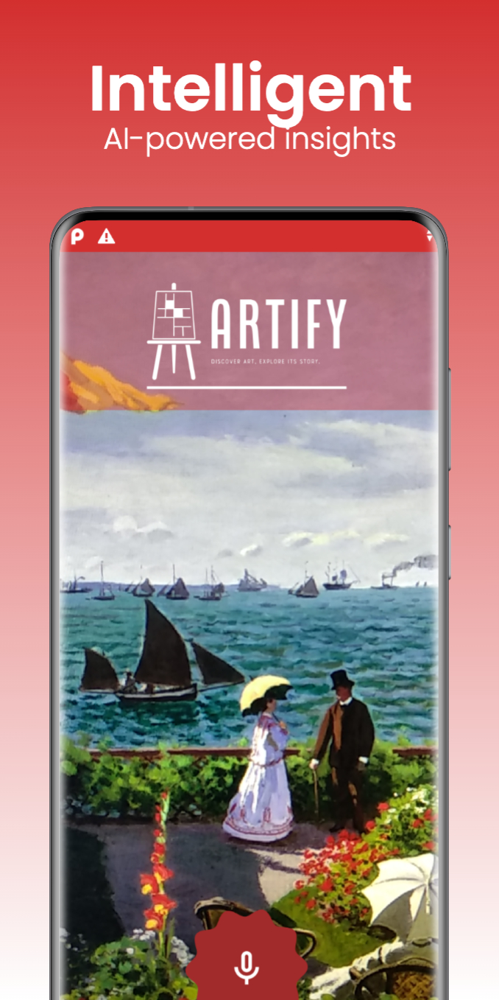

# Artify - Virtual Art Gallery 🎨🖼️

**Artify** is an innovative mobile application that allows you to explore the world of art in a completely new way. With the advanced technology of **Gemini SDK**, Artify turns your device into a virtual art gallery, letting you interact with artworks, discover details, history, and context about each piece in real-time—just by capturing an image.

Whether you're at a museum 🏛️, visiting an art gallery 🎨, or simply exploring at home 🏠, **Artify** offers instant access to detailed information about the artworks you encounter, turning art discovery into an interactive and educational experience.

This app, **Artify**, includes images and resources designed by [Freepik](https://www.freepik.com). We would like to thank Freepik for their incredible design resources. The images used in the app are provided with attribution, as required by Freepik's licensing terms. For more information on Freepik's resources, visit [www.freepik.com](https://www.freepik.com).

  
  
  
  
  
  

  
  
  
  
  

## 🚀 Key Features

- **AI-Powered Visual Exploration** 🤖📷: Use Gemini SDK to recognize artworks, sculptures, and other artistic elements through your camera and obtain instant, accurate information.
- **Natural Language Interaction** 💬: Ask questions in conversational language and receive detailed, natural responses.
- **Speech-to-Text and Text-to-Speech Integration** 🗣️🔊: Use your voice to ask questions via Speech-to-Text and listen to the answers through Text-to-Speech, making the interaction even smoother.
- **Organized Conversations with Artify** 🗂️💬: Each interaction with an artwork creates an "Art Conversation" where you can ask questions and receive answers about that specific piece.
- **Dynamic Learning** 📘🌍: Turn everyday encounters into learning opportunities, discovering historical facts, technical details, and the context of the artworks you find.
- **Enhanced User Experience** 🖥️✨: Built with **Jetpack Compose**, the app offers a modern UI with fluid animations and intuitive navigation.

## 🧠 How Artify Works

- **Firestore** 🔥📂: Used to store "Art Conversations"—topics of conversation derived from images taken by the user. Each conversation is linked to a specific artwork and its details.
- **Firestorage** 🗄️📸: Stores the images captured by the user, which are analyzed by Gemini SDK to provide insightful answers about the artworks or scenes in the photos.
- **Gemini SDK** 🌟🤖: The AI engine that powers image analysis and natural language understanding, providing detailed answers to user queries based on the images and topics.
- **Speech-to-Text and Text-to-Speech** 🗣️🔄🔊: Allows users to interact with Artify using their voice, asking questions verbally and listening to answers, improving accessibility and convenience.

## 🔍 Home Screen Features

- **Art Conversations List** 📄: View all your art conversations—your ongoing topics of conversation. Each conversation corresponds to a captured artwork and its related questions and answers.
- **Search Functionality** 🔎: Easily search through your art conversations to find specific topics or answers.
- **Delete Functionality** 🗑️: Manage your art conversations by deleting those you no longer need.
- **Detailed View** 👁️: Access the details of each art conversation, where you can continue the conversation by asking more questions and receiving answers.

## ✨ User Experience Enhancements

- **Optimized Performance** ⚡: Using coroutines ensures smooth, lag-free interactions.
- **Intuitive Navigation** 🧭: The UI, built with **Jetpack Compose**, provides a modern, fluid experience that adapts to user input, making the app feel natural and easy to use.
- **Dynamic Responses** 🎯: The combination of Gemini SDK and MVI architecture delivers precise, dynamic answers that evolve with user input, creating a responsive and personalized experience.

## 🛠️ Clean Architecture & MVI for a Robust Foundation

Artify is built on **Clean Architecture** principles, ensuring the application is scalable, maintainable, and testable. This architecture promotes clear separation of concerns, with well-defined layers for data, domain, and presentation, resulting in a robust codebase that integrates seamlessly with the **Gemini SDK**.

By using **Model-View-Intent (MVI)** as the UI architectural pattern, Artify provides a reactive and unidirectional data flow, enhancing the overall user experience and maintaining the app's consistency and extensibility.

- **Domain-Centric Design** 🧩: Business logic is encapsulated in the domain layer, which interacts with data sources (e.g., repositories) and manages the flow of information to and from the UI.
- **Seamless Integration with Gemini SDK** 🤖🌐: The Clean Architecture approach ensures smooth integration with the Gemini SDK, optimizing performance in image recognition and natural language processing tasks.

## 🧰 Technologies Used

- **Kotlin** 💻: The primary programming language for Android development.
- **Jetpack Compose** 🖌️: A modern, declarative UI toolkit that allows for flexible and scalable UI design.
- **Gemini SDK** 🚀🤖: The core of the app's AI capabilities, powering image recognition and natural language understanding.
- **Firestore** 🔥: Manages the storage of art conversations, providing a structured and scalable way to handle conversation topics.
- **Firestorage** 📸: Stores images analyzed by Gemini to generate detailed responses.
- **Coroutines** ⏱️: Manages asynchronous tasks to ensure smooth, seamless interactions.
- **Hilt/Dagger** 🛠️: Dependency injection frameworks that provide clear module separation and scalability.
- **Retrofit** 🌐: Manages network communication with external APIs.
- **Coil** 🎨: Image loading library that integrates seamlessly with Jetpack Compose for high-performance image handling.

## Development with the Brownie UI Library

🍫 **Brownie**: [Jetpack Compose UI Library](https://github.com/sergio11/brownie_ui_library) 🚀

Brownie is a Jetpack Compose library that provides a set of pre-defined components to accelerate Android UI development. It helps developers apply best practices in screen state management and utilize the most effective design patterns.

### Features 🎉

- **Pre-defined Components**: Brownie offers a variety of ready-to-use components, such as buttons, lists, and cards, to facilitate attractive and consistent UI creation.
- **State Management**: Facilitates screen state management by implementing patterns like MVI or MVVM.
- **Customization**: Brownie components are highly customizable and easily adapt to any app's visual style.
- **Jetpack Compose Compatibility**: Fully integrated with Jetpack Compose, ensuring optimal performance and smooth development.

### Model-View-Intent (MVI) Architecture 🏗️

Brownie encourages using the MVI architecture pattern for effective screen state management. In this pattern:

- **Model**: Represents the UI state. Brownie provides a `BrownieViewModel` class that handles the UI state.
- **View**: Renders the UI based on the state provided by the ViewModel. Brownie components are seamlessly integrated with Compose for declarative UI.
- **Intent**: Represents user actions or events that trigger state changes.

For more information, visit [Brownie UI Library on GitHub](https://github.com/sergio11/brownie_ui_library) and give it a ⭐ to show your support!
